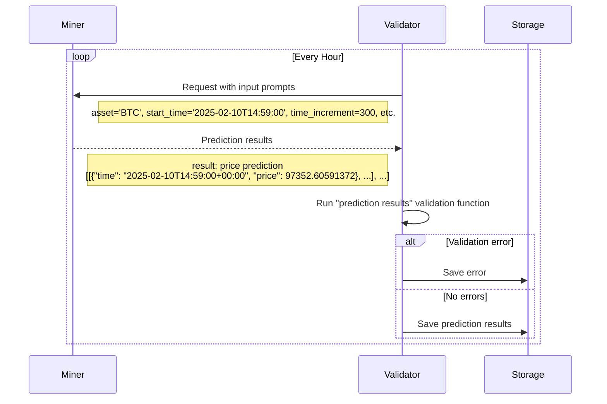

# NetUID 50 — Synth (`ש`)

## Overview

Predictive intelligence for financial markets and beyond

**From crawled page (site or GitHub):** Synth delivers synthetic asset price path data generated through a decentralized network of AI models. Our innovative approach simulates diverse market conditions, providing unparalleled forecasting accuracy and actionable insights for optimal financial decision-making.

## Operational parameters — registration, limits, economics (chain)

**What is on-chain here:** consensus / registration economics (burns, immunity, capacities, tempo, weight rules). These are **not** GPU SKU requirements—those live in subnet code and READMEs (see the next section when GitHub excerpts are available).

### Topology & economics (`SubnetInfo` snapshot)

- **`max_n` (max registered UIDs):** 256
- **`subnetwork_n`:** 256
- **Max validators allowed (`max_allowed_validators`):** 64
- **Min weights per neuron (`min_allowed_weights`):** 1
- **`max_weights_limit` (consensus-encoded cap):** 65535
- **`tempo` (blocks between epoch advances):** 360
- **`scaling_law_power`:** 50
- **`modality` ID:** `0`
- **`emission_value` (display field):** 0
- **`difficulty` (PoW field on info view):** 10000000
- **`immunity_period` (blocks):** 65535
- **Registration recycle cost snapshot (`burn`):** τ0.800000000
- **Owner SS58 (`owner_ss58`):** `5DxyiWpGqN5xXiczXcEGph51BcgTqcYKD5GKZqoACuc2sJkD`

### Consensus hyperparameters (`SubnetHyperparameters` snapshot)

- **Registration allowed:** `True`
- **`min_burn` / `max_burn` (RAO envelope):** τ0.800000000 / τ100.000000000
- **PoW `difficulty` + bounds:** `10000000` (min `10000000`, max `18446744073709551615`)
- **`target_regs_per_interval`:** `1`
- **`immunity_period`:** `65535` blocks
- **`max_regs_per_block`:** `1`
- **`serving_rate_limit`:** `50`
- **`weights_rate_limit`:** `100`
- **`activity_cutoff`:** `5000` blocks
- **`commit_reveal_weights_enabled`:** `False`
- **`commit_reveal_period`:** `1`
- **`liquid_alpha_enabled`:** `False`
- **`user_liquidity_enabled` (subnet pool):** `False`
- **`bonds_reset_enabled` / `bonds_moving_avg`:** `False` / `900000`
- **`subnet_is_active`:** `True`
- **`yuma_version`:** `2`
- **`alpha_sigmoid_steepness` / `alpha_high` / `alpha_low`:** 1000.0, `58982`, `45875`

- **Docs:** [Subnet hyperparameters (Learn Bittensor)](https://learnbittensor.org/explore/concept/subnet-hyperparameters)

## Miner / validator compute notes (README excerpts)

### 1.2. Task Presented to the Miners

Miners are tasked with providing probabilistic forecasts of an asset's future price movements. Specifically, each miner is required to generate multiple simulated price paths for an asset, from the current time over specified time increments and time horizon. Initially, all checking prompts were to produce 100 simulated paths for the future price of bitcoin at 5-minute time increments for the next 24 hours. As of November 13, 2025, the network has been upgraded to request that miners produce 1000 simulated paths for the future price of BTC, ETH, SOL, and XAU for the next 24 hours. This upgrade reflects Synth’s commitment to developing high frequency trading capabilities. January 2026, further assets were added to Synth predictions. 5 tokenized equity assets, SPYX, NVDAX, TSLAX, AAPLX, and GOOGLX are now included in the 24-Hour predictions. In March 2026, 3 new assets were launched on the 24-Hour horizon: XRP, HYPE, and WTIOIL. HYPE was also added to the 1-Hour horizon.

Whereas other subnets ask miners to predict single values for future prices, we’re interested in the miners correctly quantifying uncertainty. We want their price paths to represent their view of the probability distribution of the future price, and we want their paths to encapsulate realistic price dynamics, such as volatility clustering and skewed fat tailed price change distributions. As the network matures, modelling the correlations between asset prices will be essential.

If the miners do a good job, the Synth Subnet will become the world-leading source of realistic synthetic price data for training AI agents. And it will be the go-to location for asking questions on future price probability distributions - a valuable resource for options trading and portfolio management.

The checking prompts sent to the miners will have the format:
(start_time, asset, time_increment, time_horizon, num_simulations)

The 24-Hour prompt parameters have the following values:

- **Start Time ($t_0$)**: 1 minute from the time of the request.
- **Asset**: BTC, ETH, XAU, SOL, SPYX, NVDAX, TSLAX, AAPLX, GOOGLX, XRP, HYPE, WTIOIL.
- **Time Increment ($\Delta t$)**: 5 minutes.
- **Time Horizon ($T$)**: 24 hours.
- **Number of Simulations ($N_{\text{sim}}$)**: 1000.

The 1-Hour prompt parameters have the following values:

- **Start Time ($t_0$)**: 1 minute from the time of the request.
- **Asset**: BTC, ETH, SOL, XAU, HYPE.
- **Time Increment ($\Delta t$)**: 1 minute.
- **Time Horizon ($T$)**: 1 hour.
- **Number of Simulations ($N_{\text{sim}}$)**: 1000.

**Asset Weights**

| Asset  | Weight             |
| ------ | ------------------ |
| BTC    | 1.0                |
| ETH    | 0.7064366394033871 |
| XAU    | 1.7370922597118699 |
| SOL    | 0.6310037175639559 |
| SPYX   | 3.437935601155441  |
| NVDAX  | 1.6028217601617174 |
| TSLAX  | 1.6068755936957768 |
| AAPLX  | 2.0916380815843123 |
| GOOGLX | 1.6827392777257926 |
| XRP    | 0.5658394110809131 |
| HYPE   | 0.4784547133706857 |
| WTIOIL | 0.8475062847978935 |

Validators cycle through the assets, sending out prediction requests at regular intervals. The miner has until the start time to return ($N_{\text{sim}}$) paths, each containing price predictions at times given by:

$$
t_i = t_0 + i \times \Delta t, \quad \text{for }\, i = 0, 1, 2, \dots, N
$$

where:

- $N = \dfrac{T}{\Delta t}$ is the total number of increments.

We recommend the miner sends a request to the Pyth Oracle to acquire the price of the asset at the start_time.

If they fail to return predictions by the start_time or the predictions are in the wrong format, they will be scored 0 for that prompt.

**Emissions Split**

24-Hour Predictions: 50% of total emissions
1-Hour HFT Predictions: 50% of total emissions

[Back to top ^][table-of-contents]

---

### 1.3. Validator's Scoring Methodology

The role of the validators is, after the time horizon has passed, to judge the accuracy of each miner’s predicted paths compared to how the price moved in reality. The validator evaluates the miners' probabilistic forecasts using the Continuous Ranked Probability Score (CRPS). The CRPS is a proper scoring rule that measures the accuracy of probabilistic forecasts for continuous variables, considering both the calibration and sharpness of the predicted distribution. The lower the CRPS, the better the forecasted distribution predicted the observed value.

---

### 2.2. Validators

Please refer to this [guide](./docs/validator_guide.md) for more detailed instructions on getting a validator up and running.

[Back to top ^][table-of-contents]

*README source used for excerpts: `https://raw.githubusercontent.com/mode-network/synth-subnet/main/README.md`.*

*Headings were selected heuristically (hardware / miner / validator / requirements). Always read the full README in the repo.*

## On-chain identity — description

Predictive intelligence for financial markets and beyond

## On-chain identity — additional field

*Empty — no additional field set, or identity missing.*

## Registered contact & links

- **Website:** [https://synthdata.co](https://synthdata.co)
- **GitHub:** [https://github.com/mode-network/synth-subnet](https://github.com/mode-network/synth-subnet)
- **Logo URL:** [https://taostats.io/images/subnets/50.webp?w=96&q=75](https://taostats.io/images/subnets/50.webp?w=96&q=75)

## Alpha price vs TAO (history)

### Short window — on-chain α price (public RPC state retention)

Most public Finney RPC nodes discard state after only **hundreds of blocks**, so this is a **true** but **very short** slice of history (samples every **48** blocks out to roughly **576** blocks).
| Block | α price (TAO) |
|------:|----------------:|
| 8103642 | 0.009229283 |
| 8103690 | 0.009229149 |
| 8103738 | 0.009229112 |
| 8103786 | 0.009228977 |
| 8103834 | 0.009228968 |
| 8103882 | 0.009241261 |

### Extended history — TAOStats pool price (daily)

Provide **`TAOSTATS_API_KEY`** in the environment (or **`--taostats-api-key`**) to pull roughly **weekly–monthly** cadence historical prices from TAOStats. Without a key, only the abbreviated on-chain samples above populate automatically.

## Web crawl (supplementary)

- **Document title:** Synth | Succeed in Financial Markets with Predictive Intelligence
- **Meta / og:description:** Synth delivers synthetic asset price path data generated through a decentralized network of AI models. Our innovative approach simulates diverse market conditions, providing unparalleled forecasting accuracy and actionable insights for optimal financial decision-making.
- **Fetched from:** [https://synthdata.co](https://synthdata.co)

---

*Snapshot: Subtensor `finney`, head block **8103882**, 2026-05-03 15:06 UTC. Regenerate via `scripts/generate_subnet_pages.py`. Chain excerpts are authoritative for protocol fields; README parsing is heuristic; TAOStats history requires API access.*

