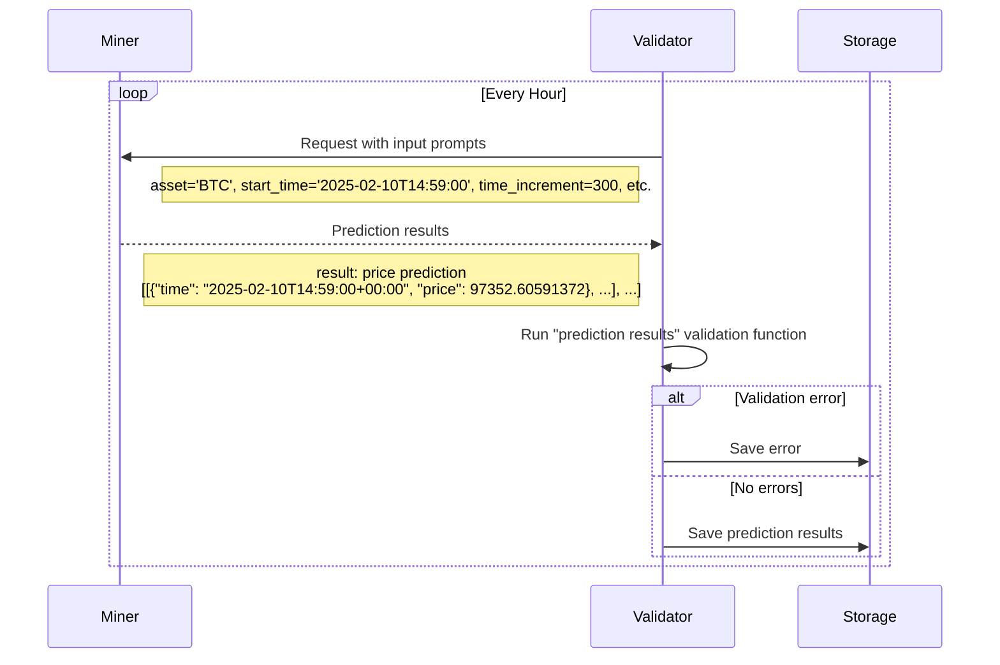

# NetUID 50 — Synth (`ש`)

## Overview

**Synth** (NetUID **50**) (`ש`).

Predictive intelligence for financial markets and beyond

### Chain & market snapshot *(from `DynamicInfo`)*

- **Tempo / epoch pacing:** `360` blocks between steps; **blocks since last step:** `240`. **Emission allocation field:** `τ0.000000000` *(protocol snapshot at block 8104277)*.
- **TAO routed into swap pool reserves:** **`tao_in`** = τ14,886.157645856. **Alpha liquidity in pool (`alpha_in`)** = ‎1,597,051.827661106ש‎; **`alpha_out`** (off-pool bonded/staked tally) = ‎3,117,183.956252497ש‎.
- **Implied Alpha spot:** **`price`** τ per α unit ≈ **`τ0.009346570`** *(also **moving-average price** `0.009504340589046478` used in some dashboards)*.
- **Outstanding subnet volume accumulator:** `‎1,081,296.557684353ש‎`. **Owner hotkey / coldkey (chain):** `5DxyiWpGqN5xXiczXcEGph51BcgTqcYKD5GKZqoACuc2sJkD` / `5DxyiWpGqN5xXiczXcEGph51BcgTqcYKD5GKZqoACuc2sJkD`.
- **Subnet registered at block:** `4763204` (see explorers for approximate wall-clock age). **Is dynamic liquidity subnet:** `True`.
- **Pending emissions cues:** pending α emission `‎180.403465148ש‎`; pending root emission `τ0.000000000`.
- **Per-flow emission splits:** τ-in `τ0.000000000` · α-out `‎1.000000000ש‎` · α-in `‎0.000000000ש‎`.

### TAOStats snapshot *(off-chain index)*

Sources: [subnet latest](https://docs.taostats.io/reference/get-subnets-1), [pool latest](https://docs.taostats.io/reference/get-subnet-pools).
#### Liquidity pool (TAOStats)

- **Block (API):** `8104202`
- **Time (API):** `2026-05-03T16:10:00Z`
- **Price τ/α:** `0.009346622`
- **Market cap:** `41201064743262.905420608`
- **Liquidity:** `29813197393241`
- **Total τ:** `14886199173860`
- **Total α:** `4714160783913603`
- **α in pool:** `1597047384539695`
- **α staked:** `2811076186014769`
- **Price Δ 1h:** `1.140432357936690692`
- **Price Δ 1d:** `0.095612471344638194`
#### Subnet activity (TAOStats)

- **Block (API):** `8104199`
- **Time (API):** `2026-05-03T16:09:24.001Z`
- **Active keys:** `256`
- **Active validators:** `13`
- **Active miners:** `238`
- **Active dual:** `0`
- **Emission:** `0`
- **Max neurons:** `256`
- **Validators (metadata):** `13`
- **Neuron reg. cost:** `800000000`

### On-chain declared purpose *(SubnetIdentity)*

Predictive intelligence for financial markets and beyond

### Repository README excerpt *(everything before first `##` heading)*

  

<h1 align="center">
    Synth Subnet
</h1>

    <a href="https://www.synthdata.co" target="_blank">
        <b>Website</b>
    </a>
·
    <a href="https://github.com/synthdataco/synth-subnet/blob/main/Synth%20Whitepaper%20v1.pdf" target="_blank">
        <b>Whitepaper</b>
    </a>
·
    <a href="https://discord.gg/gnt8sFMdg6" target="_blank">
        <b>Discord</b>
    </a>
·
    <a href="https://api.synthdata.co/docs" target="_blank">
        <b>API Documentation</b>
    </a>

---

[][license]

---

### Table of contents

- [1. Overview](#-1-overview)
  - [1.1. Introduction](#11-introduction)
  - [1.2. Task Presented to the Miners](#12-task-presented-to-the-miners)
  - [1.3. Validator's Scoring Methodology](#13-validators-scoring-methodology)
  - [1.4. Calculation of Leaderboard Score](#14-calculation-of-leaderboard-score)
  - [1.5. Overall Purpose](#15-overall-purpose)
- [2. Usage](#-2-usage)
  - [2.1. Miners](#21-miners)
    - [2.1.1. Tutorial](#211-tutorial)
    - [2.1.2. Reference](#212-reference)
  - [2.2. Validators](#22-validators)
  - [2.3. Develop](#23-develop)
- [3. License](#-3-license)

### Topology & economics (`SubnetInfo` snapshot)

- **`max_n` (max registered UIDs):** 256
- **`subnetwork_n`:** 256
- **Max validators allowed (`max_allowed_validators`):** 64
- **Min weights per neuron (`min_allowed_weights`):** 1
- **`max_weights_limit` (consensus-encoded cap):** 65535
- **`tempo` (blocks between epoch advances):** 360
- **`scaling_law_power`:** 50
- **`modality` ID:** `0`
- **`emission_value` (display field):** 0
- **`difficulty` (PoW field on info view):** 10000000
- **`immunity_period` (blocks):** 65535
- **Registration recycle cost snapshot (`burn`):** τ0.800000000
- **Owner SS58 (`owner_ss58`):** `5DxyiWpGqN5xXiczXcEGph51BcgTqcYKD5GKZqoACuc2sJkD`

### Consensus hyperparameters (`SubnetHyperparameters` snapshot)

- **Registration allowed:** `True`
- **`min_burn` / `max_burn` (RAO envelope):** τ0.800000000 / τ100.000000000
- **PoW `difficulty` + bounds:** `10000000` (min `10000000`, max `18446744073709551615`)
- **`target_regs_per_interval`:** `1`
- **`immunity_period`:** `65535` blocks
- **`max_regs_per_block`:** `1`
- **`serving_rate_limit`:** `50`
- **`weights_rate_limit`:** `100`
- **`activity_cutoff`:** `5000` blocks
- **`commit_reveal_weights_enabled`:** `False`
- **`commit_reveal_period`:** `1`
- **`liquid_alpha_enabled`:** `False`
- **`user_liquidity_enabled` (subnet pool):** `False`
- **`bonds_reset_enabled` / `bonds_moving_avg`:** `False` / `900000`
- **`subnet_is_active`:** `True`
- **`yuma_version`:** `2`
- **`alpha_sigmoid_steepness` / `alpha_high` / `alpha_low`:** 1000.0, `58982`, `45875`

- **Docs:** [Subnet hyperparameters (Learn Bittensor)](https://learnbittensor.org/explore/concept/subnet-hyperparameters)

## Miner / validator hardware (CPU/GPU/RAM)

#### Sections matched by heading (miner / validator / hardware / requirements)

### 1.2. Task Presented to the Miners

Miners are tasked with providing probabilistic forecasts of an asset's future price movements. Specifically, each miner is required to generate multiple simulated price paths for an asset, from the current time over specified time increments and time horizon. Initially, all checking prompts were to produce 100 simulated paths for the future price of bitcoin at 5-minute time increments for the next 24 hours. As of November 13, 2025, the network has been upgraded to request that miners produce 1000 simulated paths for the future price of BTC, ETH, SOL, and XAU for the next 24 hours. This upgrade reflects Synth’s commitment to developing high frequency trading capabilities. January 2026, further assets were added to Synth predictions. 5 tokenized equity assets, SPYX, NVDAX, TSLAX, AAPLX, and GOOGLX are now included in the 24-Hour predictions. In March 2026, 3 new assets were launched on the 24-Hour horizon: XRP, HYPE, and WTIOIL. HYPE was also added to the 1-Hour horizon.

Whereas other subnets ask miners to predict single values for future prices, we’re interested in the miners correctly quantifying uncertainty. We want their price paths to represent their view of the probability distribution of the future price, and we want their paths to encapsulate realistic price dynamics, such as volatility clustering and skewed fat tailed price change distributions. As the network matures, modelling the correlations between asset prices will be essential.

If the miners do a good job, the Synth Subnet will become the world-leading source of realistic synthetic price data for training AI agents. And it will be the go-to location for asking questions on future price probability distributions - a valuable resource for options trading and portfolio management.

The checking prompts sent to the miners will have the format:
(start_time, asset, time_increment, time_horizon, num_simulations)

The 24-Hour prompt parameters have the following values:

- **Start Time ($t_0$)**: 1 minute from the time of the request.
- **Asset**: BTC, ETH, XAU, SOL, SPYX, NVDAX, TSLAX, AAPLX, GOOGLX, XRP, HYPE, WTIOIL.
- **Time Increment ($\Delta t$)**: 5 minutes.
- **Time Horizon ($T$)**: 24 hours.
- **Number of Simulations ($N_{\text{sim}}$)**: 1000.

The 1-Hour prompt parameters have the following values:

- **Start Time ($t_0$)**: 1 minute from the time of the request.
- **Asset**: BTC, ETH, SOL, XAU, HYPE.
- **Time Increment ($\Delta t$)**: 1 minute.
- **Time Horizon ($T$)**: 1 hour.
- **Number of Simulations ($N_{\text{sim}}$)**: 1000.

**Asset Weights**

| Asset  | Weight             |
| ------ | ------------------ |
| BTC    | 1.0                |
| ETH    | 0.7064366394033871 |
| XAU    | 1.7370922597118699 |
| SOL    | 0.6310037175639559 |
| SPYX   | 3.437935601155441  |
| NVDAX  | 1.6028217601617174 |
| TSLAX  | 1.6068755936957768 |
| AAPLX  | 2.0916380815843123 |
| GOOGLX | 1.6827392777257926 |
| XRP    | 0.5658394110809131 |
| HYPE   | 0.4784547133706857 |
| WTIOIL | 0.8475062847978935 |

Validators cycle through the assets, sending out prediction requests at regular intervals. The miner has until the start time to return ($N_{\text{sim}}$) paths, each containing price predictions at times given by:

$$
t_i = t_0 + i \times \Delta t, \quad \text{for }\, i = 0, 1, 2, \dots, N
$$

where:

- $N = \dfrac{T}{\Delta t}$ is the total number of increments.

We recommend the miner sends a request to the Pyth Oracle to acquire the price of the asset at the start_time.

If they fail to return predictions by the start_time or the predictions are in the wrong format, they will be scored 0 for that prompt.

**Emissions Split**

24-Hour Predictions: 50% of total emissions
1-Hour HFT Predictions: 50% of total emissions

[Back to top ^][table-of-contents]

---

### 1.3. Validator's Scoring Methodology

Th…

---

#### CPU / GPU / RAM lines (automatic grep)

*No sizing lines matched the scrape heuristics — see `docs/`, repo guides, Discord, or homepage.*

*Primary README URL used: `https://raw.githubusercontent.com/mode-network/synth-subnet/main/README.md`*

## On-chain identity — description

Predictive intelligence for financial markets and beyond

## On-chain identity — additional field

*Unset.*

## Registered contact & links

- **Website:** [https://synthdata.co](https://synthdata.co)
- **GitHub:** [https://github.com/mode-network/synth-subnet](https://github.com/mode-network/synth-subnet)
- **Logo URL:** [https://taostats.io/images/subnets/50.webp?w=96&q=75](https://taostats.io/images/subnets/50.webp?w=96&q=75)

## Alpha price vs TAO (history)

### Short window — on-chain α price (public RPC state retention)

*Probes every **48** blocks, lookback ≈ **576** blocks (bounded by typical public RPC history depth).*
| Block | α price (TAO) |
|------:|----------------:|
| 8104085 | 0.009383545 |
| 8104133 | 0.009345938 |
| 8104181 | 0.009346527 |
| 8104229 | 0.009346596 |
| 8104277 | 0.00934657 |

### Extended history — TAOStats pool price (daily)

[TAOStats](https://docs.taostats.io/reference/get-historical-subnet-pools) daily pool **`price`** (TAO per α), **120** rows in this snapshot.

| Timestamp (UTC) | Block | Pool price |
|-----------------|------:|-----------:|
| 2026-03-09T23:59:48Z | 7711060 | 0.009470143 |
| 2026-03-10T23:59:48Z | 7718257 | 0.009724645 |
| 2026-03-11T23:59:48Z | 7725455 | 0.010114755 |
| 2026-03-12T23:59:48.001Z | 7732653 | 0.010268604 |
| 2026-03-13T23:59:48Z | 7739841 | 0.010546137 |
| 2026-03-14T23:59:48.001Z | 7747036 | 0.010505916 |
| 2026-03-15T23:59:48Z | 7754226 | 0.010127598 |
| 2026-03-16T23:59:48Z | 7761426 | 0.009265654 |
| 2026-03-17T23:59:48Z | 7768619 | 0.009346487 |
| 2026-03-18T23:59:48Z | 7775819 | 0.009597057 |
| 2026-03-19T23:59:48Z | 7783014 | 0.00960330073769551459 |
| 2026-03-20T23:59:48Z | 7790201 | 0.00959929 |
| 2026-03-21T23:59:48Z | 7797398 | 0.009480836 |
| 2026-03-22T23:59:48Z | 7804598 | 0.009418074 |
| 2026-03-23T23:59:48Z | 7811798 | 0.009365 |
| 2026-03-24T23:59:48.001Z | 7818996 | 0.00943407672595798077 |
| 2026-03-25T23:59:48Z | 7826196 | 0.008997899 |
| 2026-03-26T23:59:48Z | 7833396 | 0.008881553 |
| 2026-03-27T23:59:48Z | 7840596 | 0.009297914 |
| 2026-03-28T23:59:48.001Z | 7847743 | 0.009026361 |
| 2026-03-29T23:59:48Z | 7854902 | 0.009128779 |
| 2026-03-30T23:59:48.001Z | 7862095 | 0.009263285 |
| 2026-03-31T23:59:48Z | 7869291 | 0.009239197 |
| 2026-04-01T23:59:48Z | 7876474 | 0.009476165 |
| 2026-04-02T23:59:48Z | 7883622 | 0.009187224 |
| 2026-04-03T23:59:48Z | 7890794 | 0.009913065 |
| 2026-04-04T23:59:48.001Z | 7897988 | 0.009958922 |
| 2026-04-05T23:59:48Z | 7905188 | 0.010469981 |
| 2026-04-06T23:59:48Z | 7912388 | 0.010435183 |
| 2026-04-07T23:59:48Z | 7919588 | 0.01189349 |
| 2026-04-08T23:59:48Z | 7926788 | 0.012341245 |
| 2026-04-09T23:59:48Z | 7933987 | 0.010786784 |
| 2026-04-10T23:59:48Z | 7941184 | 0.012363535 |
| 2026-04-11T23:59:48Z | 7948384 | 0.011443771 |
| 2026-04-12T23:59:48Z | 7955584 | 0.012006265 |
| 2026-04-13T23:59:48Z | 7962784 | 0.011550176 |
| 2026-04-14T23:59:48Z | 7969979 | 0.011794591 |
| 2026-04-15T23:59:48.001Z | 7977179 | 0.011664996 |
| 2026-04-16T23:59:48Z | 7984379 | 0.010674189 |
| 2026-04-17T23:59:48Z | 7991579 | 0.010463837 |
| 2026-04-18T23:59:48Z | 7998779 | 0.009728562 |
| 2026-04-19T23:59:48Z | 8005979 | 0.009725813 |
| 2026-04-20T23:59:48Z | 8013179 | 0.009583332 |
| 2026-04-21T23:59:48Z | 8020376 | 0.009082026 |
| 2026-04-22T23:59:48Z | 8027562 | 0.009434841 |
| 2026-04-23T23:59:48Z | 8034762 | 0.009204417 |
| 2026-04-24T23:59:48Z | 8041962 | 0.008902638 |
| 2026-04-25T23:59:48Z | 8049151 | 0.00905021 |
| 2026-04-26T23:59:48Z | 8056274 | 0.009220012 |
| 2026-04-27T23:59:48.001Z | 8063454 | 0.009015617 |
| 2026-04-28T23:59:48Z | 8070646 | 0.009052226 |
| 2026-04-29T23:59:48Z | 8077790 | 0.009350069 |
| 2026-04-30T23:59:48Z | 8084984 | 0.009679931 |
| 2026-05-01T23:59:48Z | 8092168 | 0.00990034 |
| 2026-05-02T23:59:48Z | 8099357 | 0.00933759 |
| 2026-05-03T16:10:00Z | 8104202 | 0.009346622 |

---

*Subtensor `finney`, block **8104277**, 2026-05-03 16:25 UTC. Regenerate: `scripts/generate_subnet_pages.py`.*

